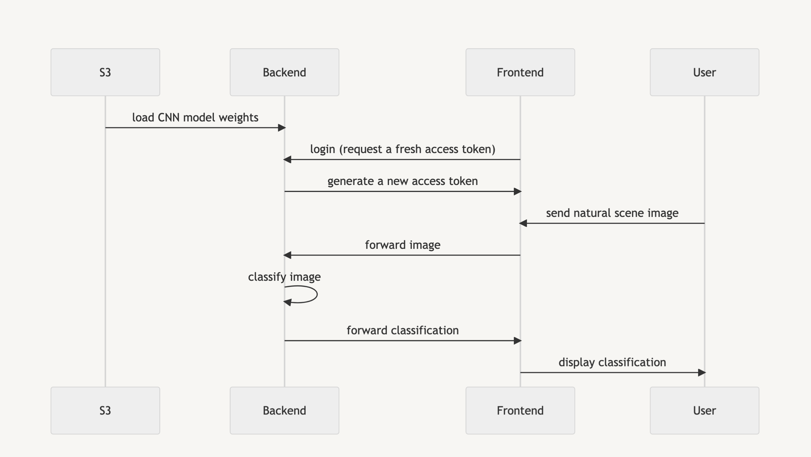
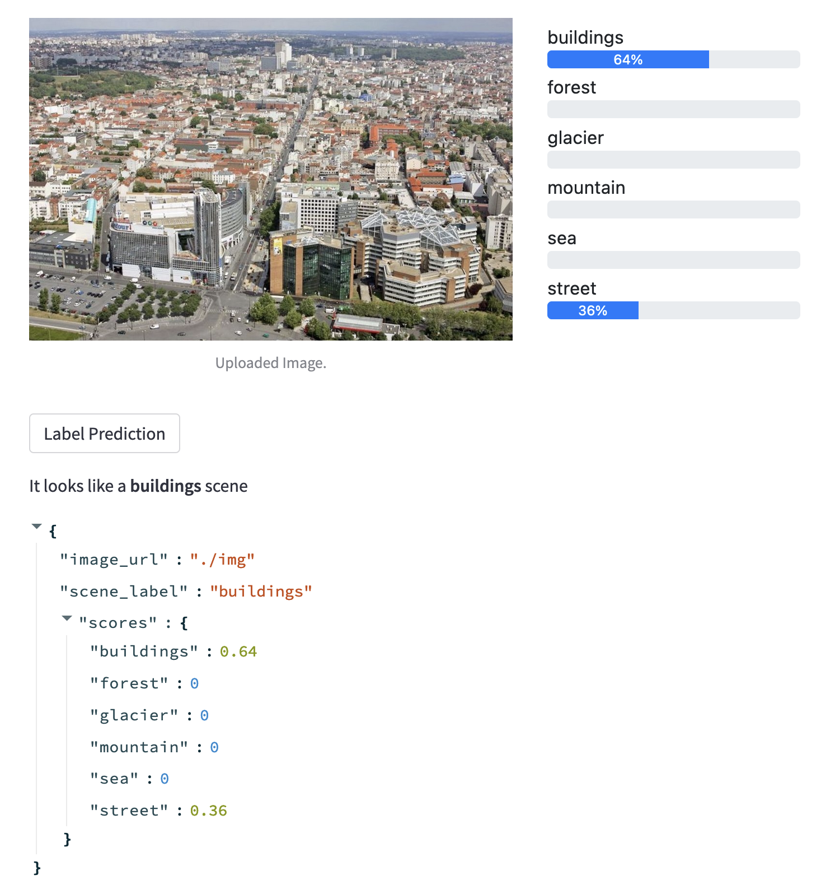

# SCENE CLASSIFICATION SERVICE 
<button name="button" onclick="http://scene-recognition.recipi.io:8585/">Demo</button>

Designed and implemented a natural scene image classification service from the ground up, utilizing Docker for containerization, Python for programming, a convolutional neural network (CNN) as the machine learning model, FastAPI for the backend, Streamlit for the frontend and S3 for model storage. The CNN model was trained to classify natural scene images into six distinct categories: buildings, forest, glacier, mountain, sea and street.

### `Sequence Diagram`:


### A preview of a prediction made by the CNN model


## Requirments
```
Docker
Docker-compose
```

## Install Docker Engine
```
>$ chmod 774 scripts/install_docker_engine.sh
>$ ./scripts/install_docker_engine.sh
```

## Docker image building
```
>$ sudo docker build --rm -t backend:0.1 .
```
## Launching with docker-compose 
```
>$ sudo docker compose up # -d for backgound execution
```
